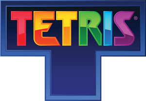
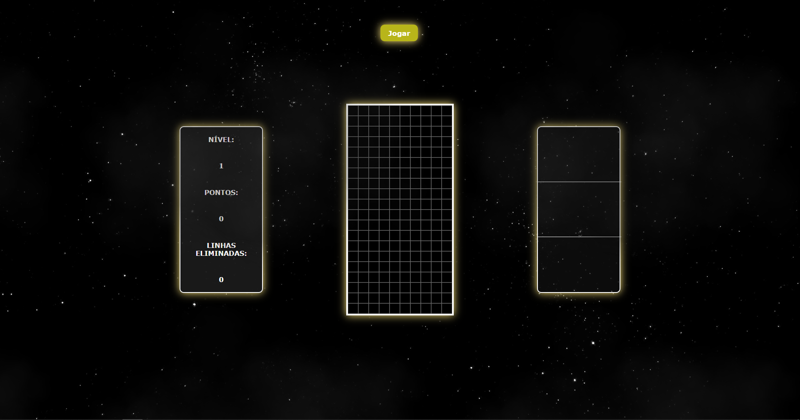
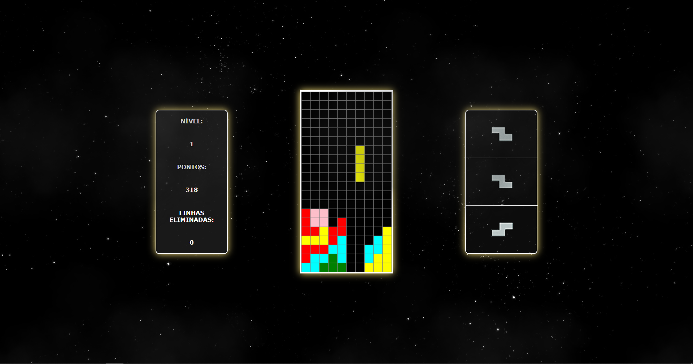
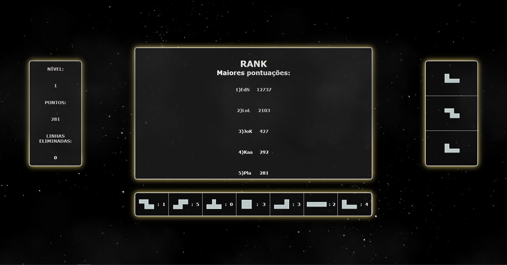

 

  

  <h3 align="center">Tetris</h3>

  
Table of Contents

  <ol>
    <li>
      <a href="#preview">Preview</a>
    </li>
    <li>
      <a href="#sobre-o-projeto">Sobre o projeto</a>
    </li>
    <li>
      <a href="#jogabilidade">Jogabilidade</a>
    </li>
    <li>
      <a href="#screenshots">Screenshots</a>
    </li>
  </ol>

## Preview
Vídeo de demonstração:  
https://drive.google.com/file/d/1JD9SNCoiHMX3xcfIbgVts9UsaHQJb3Ze/view?usp=sharing

## Sobre o projeto
Este projeto foi um trabalho da disciplina de raciocínio lógico e algoritmico no primeiro semestre da faculdade de ciência da computação.  
É uma versão do tetris, construída em vanilla javascript, html e css.  
O jogo consiste em empilhar tetraminós que descem a tela de forma que completem 
linhas horizontais. Quando uma linha se forma, ela se desintegra, as camadas superiores 
descem, e o jogador ganha pontos. Quando a pilha de peças chega ao topo da tela, a partida se 
encerra.

## Jogabilidade
<ul>
    <li>
    <h2>Mudança de nível</h2>
        <ul>
            <li>
            O jogo suporta infinitos níveis, iniciando no nível 1.
            </li>
            <li>
            A cada 10 linhas removidas, o jogador passa para o nível seguinte e a contagem de linhas removidas reinicia.
            </li>
            <li>
            A cada nível, a velocidade do jogo aumenta.
            </li>
        </ul>
    </li>
 
    <li>
        <h2>Contagem de pontos</h2>
            <ul>
                <li>
                O jogador ganha pontos a cada linha que desaparecer.
                </li>
                <li>
                A remoção de mais linhas de uma vez dá mais pontos que remover menos linhas:
                <ul>
                    <li>
                    Uma linha: 100 pontos
                    </li>
                    <li>
                    Duas linhas: 300 pontos
                    </li>
                    <li>
                    Três linhas: 500 pontos
                    </li>
                    <li>
                    Quatro linhas (Tetris): 800 pontos
                    </li>
                </ul>
                </li>
                <li>
                A quantidade exata de pontos ganhos pela eliminação de linhas depende do nível em que se encontra o jogador(os pontos são multiplicados pelo nível).
                </li>
            </ul>
        </li>
 
<li>
        <h2>Teclas</h2>
            <ul>
                <li>
                (S) -> desce o tetraminó 1 quadrado.
                </li>
                <li>
                (A) -> movimenta a peça para a esquerda.
                </li>
                <li>
                (D) -> movimenta a peça para a direita.
                </li>
                <li>
                (Z) -> gira a peça para a esquerda.
                </li>
                <li>
                (Espaço) -> queda forte.
                </li>
            </ul>
        </li>
        
<li>
        <h2>Painéis</h2>
            <ul>
                <li>
                Painel central -> contendo a tela do jogo
                </li>
                <li>
                Painel esquerdo -> contendo a pontuação do jogador, o nível atual e a quantidade de linhas eliminadas.
                </li>
                <li>
                Painel direito -> contendo os próximos 3 tetraminós.
                </li>
                <li>
                Estatística -> No final do jogo aparece as quantidades de cada uma das peças utilizadas pelo jogador durante a partida.
                </li>
            </ul>
        </li> 
 
<li>
        <h2>Efeitos sonoros</h2>
            <ul>
                <li>
                Música de fundo.
                </li>
                <li>
                Movimento das peças para baixo e para os lados.
                </li>
                <li>
                Rotação da peça.
                </li>
                <li>
                Travamento da peça.
                </li>
                <li>
                Eliminação de linhas.
                </li>
                <li>
                Fim de jogo.
                </li>
            </ul>
        </li>
 
<li>
        <h2>Ranking</h2>
            <ul>
                <li>
                No final da partida, o jogador deverá informar as iniciais do seu nome (máximo 3 letras).
                </li>
                <li>
                Após informar suas iniciais, irá aparecer o rank com as 5 pontuações mais altas e as iniciais dos respectivos jogadores.
                </li>
                <li>
                O ranking utiliza o algoritmo do bubble sort para ordenar e é mantido na aplicação usando persistência de dados.
                </li>
            </ul>
        </li>
</ul>
 

Fique à vontade para me contatar!

## Screenshots
 
 
  
